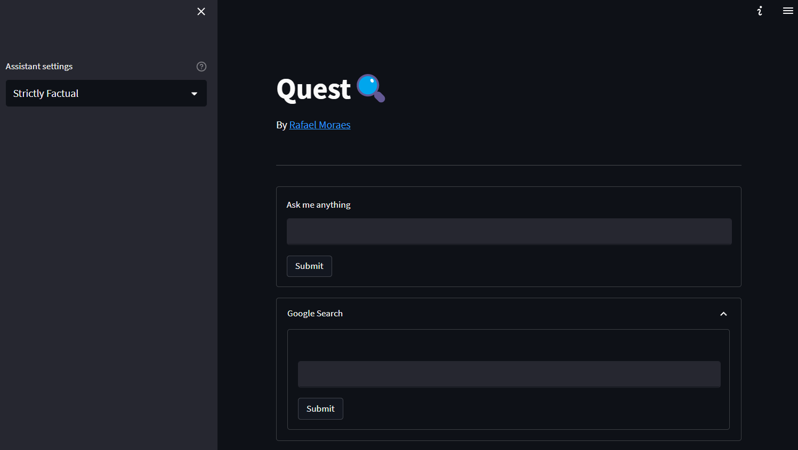

# Quest
 This is a web app that integrates GPT-3 with google searches.

 This analyses the first few results from a google search and stores snippets of text so the Assistant can remember facts. Then you can ask the Assistant about those facts and it will be able to retrive the relevant information gathered previously.

 Anyone willing to help build this tool is welcome to send merge requests.

## How can I try this out?

First, you will need an API key from OpenAI. [Click here to get your API key](https://beta.openai.com/account/api-keys). Make sure to store this key in a safe place.

Currently the web app is deployed [here](https://aichat.streamlit.app/).

## Usage

There are three main sections in this app. The 'Assistant settings', the 'Ask the Assistant', and the 'Google search'.

---
### Google search

To use the Google search box, enter a query in the text input and hit 'Submit'. This will trigger a search on Google using your query. The results will be listed and stored localy. These results can later be used by the Assistant to answer questions.

---
### Ask me anything

Using the most relevant search results and most relevant chat history, the Assistant will answer your query. It's behaviour will be different depending on the settings you chose.

---
### Assistant settings

The Assistant settings serves to determine how the Assistant will behave. If you set it to `Strictly Factual`, it will try to not say any facts beyond the Google searches. `Creative` will still use the searches, but allow itself to generate creative responses while being less concerned with factuality.

## Create your own Assistant

There are a few default settings that can be chosen to customize how the Assistant is behaves. However, you can create your own settings to open for many more possibilities. To do this, navigate to the `conversation_settings` folder and open the `_create_setting.py` file.

Inside, you can create the custom settings and give it a name. Then double-click `_create_setting_file` (.bat for Windows and .sh for macOS/Linux).
